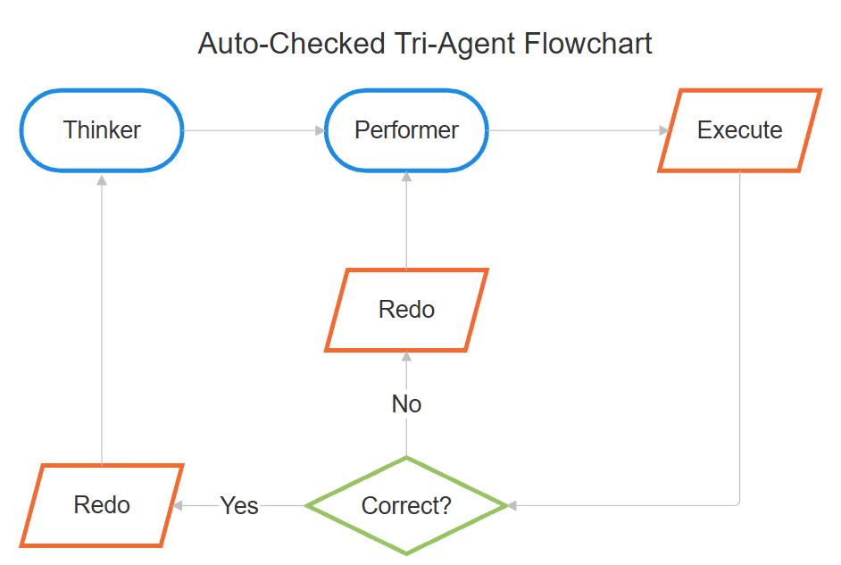

# LLMs_for_Tabular_Data_DataBench_Tests
A comparison of the RAL, ReAct, Tri-Agent Problem Solving, Unchecked Tri-Agent and Auto-Checked Tri-Agent methodologies using DataBench Lite.

DataBench can be found on [Huggingface](https://huggingface.co/datasets/cardiffnlp/databench).

More on the Tri-Agent architecture can be found in its [own repository](https://github.com/StrouggisGiorgos/Tri-Agent_Problem_Solving).

The Auto-Checked ablation of the framework is expressed in the following flowchart:

